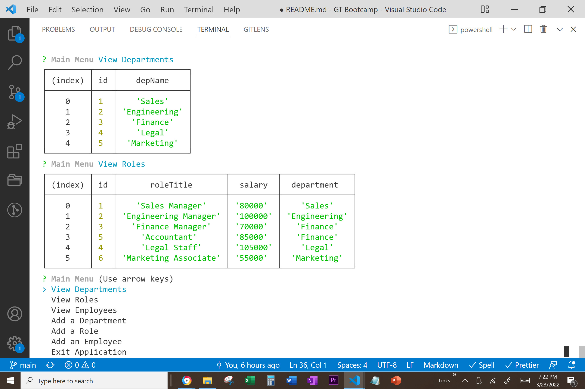

<h1 align="center"> Human Resource Management Database </h1>

<p align="center">
    
</p>

## Table of Contents

- [Table of Contents](#table-of-contents)
- [Description](#description)
- [User Story](#user-story)
- [Screenshots](#screenshots)
- [Acceptance Criteria](#acceptance-criteria)
- [Installation](#installation)
- [Usage](#usage)
- [Testing](#testing)
- [Contributing](#contributing)

## Description

🔍 A content management system (CMS) that allows end users to manage employee data using mySQL through the command line prompt.

## User Story

```md
AS A business owner
I WANT to be able to view and manage the departments, roles, and employees in my company
SO THAT I can organize and plan my business
```

## 💻 Below is a screenshot of the application:



## Acceptance Criteria

```md
GIVEN a command-line application that accepts user input
WHEN I start the application
THEN I am presented with the following options: view all departments, view all roles, view all employees, add a department, add a role, add an employee, and update an employee role
WHEN I choose to view all departments
THEN I am presented with a formatted table showing department names and department ids
WHEN I choose to view all roles
THEN I am presented with the job title, role id, the department that role belongs to, and the salary for that role
WHEN I choose to view all employees
THEN I am presented with a formatted table showing employee data, including employee ids, first names, last names, job titles, departments, salaries, and managers that the employees report to
WHEN I choose to add a department
THEN I am prompted to enter the name of the department and that department is added to the database
WHEN I choose to add a role
THEN I am prompted to enter the name, salary, and department for the role and that role is added to the database
WHEN I choose to add an employee
THEN I am prompted to enter the employee’s first name, last name, role, and manager, and that employee is added to the database
WHEN I choose to update an employee role
THEN I am prompted to select an employee to update and their new role and this information is updated in the database
```

## Installation

💾

Dependencies:
Internet Browser
VS Studio
mySQL
Inquirer

## Usage

💻

Open integrated terminal with VS Studio for server.js file
NPM install
Source the mySQL schema and seeds files
NPM start

## Testing

✏️

## YouTube Link

## GitHub Repository

https://github.com/edavis56/human-resource-mangement-database

## Contributing

✉️ Contact us with any questions ❓:

[Eric Davis](https://github.com/edavis56)
